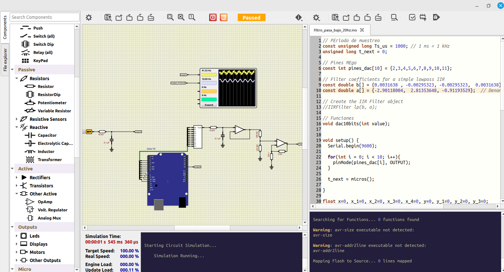
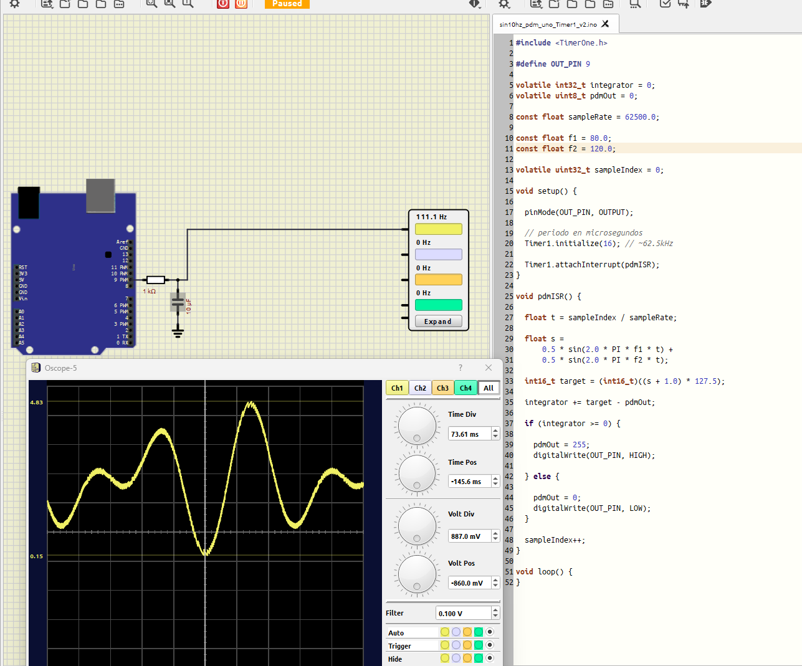

# DSP_SIMULIDE_ARDUINO

El repositorio tiene la intención de crear entornos de simulación basado en arduino y simulide para aprender y practicar el DSP embebido. Para ello en el repositorio se encuentra una serie de ejemplos sobre filtros digitales FIR, IIR diseñado en python con scipy e implementados en arduino por medio de ecuaciones en diferencia, finalmente los filtros son simulados en simulide donde por medio de los diferentes componentes del entorno de simulación nos permiten probar en tiempo real el procesamiento digital de las señales.

# Descargas:
Para poder usar y aprovechar todos los ejemplos, es necesario contar con los siguientes softwares:
- SimulIDE:  [link](https://simulide.com/p/downloads/)
- ArduinoIDE: [link](https://www.arduino.cc/en/software/)
- Google COLAB (puede ser en vscode): [link](https://colab.research.google.com/)
- MiniAnaconda (deseable): [link](https://www.anaconda.com/docs/getting-started/miniconda/install/overview)

# Código de ejemplo funcionables:

## Ejemplo01

- Código arduino: filtro_pasa_bajo_20hz.ino
- Circuito simulide: filtro_pasa_baja_UNO.sim1
- signal usado: senal4_10_100hz.wav

## Ejemplo02

- Código arduino: dac_pwam_pdm_100hz_150hz / sin10hz_pdm_uno_Timer1_v2 / sin10hz_pdm_uno
- Circuito simulide: dac_pdm_pwm.sim1 / dac_pdm_pwm_v2.sim1
